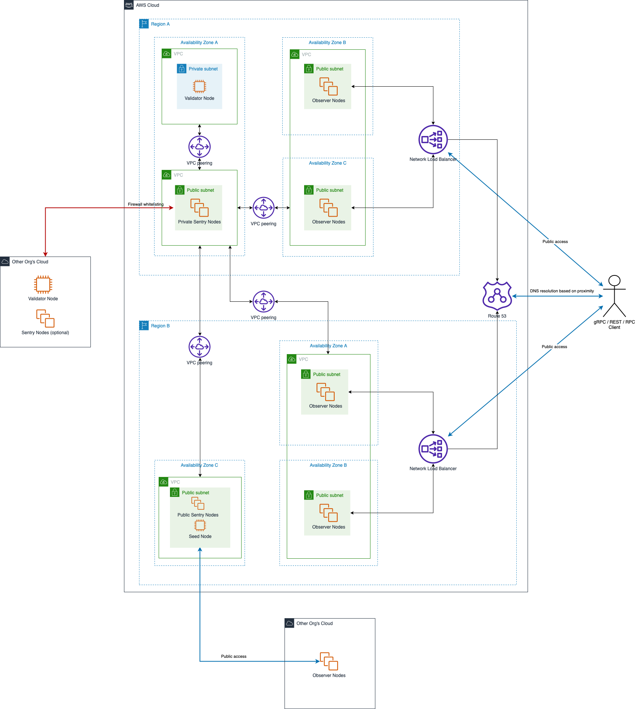

# Recommended design for DCL MainNet deployment on AWS

## AWS deployment diagram



## Recommended IaC structure and frameworks

- [Ansible](https://www.ansible.com) - provision of the following node types:
  - `Genesis Validator` - Validator Node created at the beginning of a network
  - `Non-genesis Validator` - Validator Node joined a network after a significant time period
  - `Private Sentry` - Full Node to connect other(external) Validator Nodes ([Sentry Node Architecture](https://forum.cosmos.network/t/sentry-node-architecture-overview/454))
  - `Public Sentry` - Full Node to connect other(external) Full Nodes
  - `Observer` - Full Node for serving gRPC / REST / RPC clients
  - `Seed` - Full Node for sharing IP addresses of `Public Sentry` Nodes ([Seed Node](https://docs.tendermint.com/master/nodes/#seed-nodes))

> **_Note:_** Most of the nodes should enable `state sync` to avoid catching up with a network from scratch. Refer to [running-node-in-existing-network.md](./running-node-in-existing-network.md) for details.

- [Terraform](https://www.terraform.io) - deploy an AWS infrastructure from one or more of the following modules:
  - Validator - `Validator` node instance
  - Private Sentries - Cluster of `Private Sentry` node instances
  - Public Sentries - Cluster of `Public Sentry` node instances with a collocated `Seed` node
  - Observers - Cluster of `Observer` node instances
  - Load Balancers - AWS Network Load Balancers for load balancing between `Observer` clusters

## Node specific AWS and DCL configurations

### Validator Node

- Tendermint:

  `config.toml` file:

  ```toml
  [p2p]
  pex = false
  persistent_peers = # `Private Sentry` nodes with private IPs
  addr_book_strict = false

  [consensus]
  create_empty_blocks = false
  create_empty_blocks_interval = "600s" # 10 mins
  ```

  `app.toml` file:

  ```toml
  [state-sync]
  snapshot-interval = "snapshot-interval"
  snapshot-keep-recent = "snapshot-keep-recent"
  ```

- AWS:
  - Instance type = EC2 instance
  - Network:
    - Private IPv4 = IPv4 address
    - Public IPv4 = not assigned
  - Security:
    - inbound:
      - allow `Tendermint p2p` port from `Private Sentry` Nodes' VPC CIDR
      - allow `RPC` port from `Private Sentry` Nodes' VPC CIDR
    - outbound:
      - all

### Private Sentry Node

- Tendermint:

  `config.toml` file:

  ```toml
  [p2p]
  pex = true
  persistent_peers = # `Validator` node with private IP + other orgs' validator/sentry nodes with public IPs
  private_peer_ids = # `Validator` node id
  unconditional_peers = # `Validator` node id
  addr_book_strict = false
  ```

  `app.toml` file:

  ```toml
  [state-sync]
  snapshot-interval = "snapshot-interval"
  snapshot-keep-recent = "snapshot-keep-recent"
  ```

- AWS:
  - Instance type = EC2 instance
  - Network:
    - Private IPv4 = IPv4 address
    - Public IPv4 = Elastic IP
  - Security:
    - inbound:
      - allow `Tendermint p2p` port for whitelist IPs
      - allow `RPC` port from `Observer` Nodes' VPC CIDR
      - allow `RPC` port from `Public Sentry` Nodes' VPC CIDR
    - outbound:
      - all

### Observer Node

- Tendermint:

  `config.toml` file:

  ```toml
  [p2p]
  pex = true
  persistent_peers = # `Private Sentry` nodes with private IPs
  addr_book_strict = false
  ```

  `app.toml` file:

  ```toml
  [api]
  enable = true
  ```

- AWS:
  - Instance type = EC2 instance
  - Network:
    - Private IPv4 = IPv4 address
    - Public IPv4 = not assigned
  - Security:
    - inbound:
      - allow gRPC / REST / RPC ports from the same VPC CIDR
    - outbound:
      - all

### Public Sentry Node

- Tendermint:

  `config.toml` file:

  ```toml
  [p2p]
  pex = true
  persistent_peers = # `Private Sentry` nodes with private IPs
  ```

  `app.toml` file:

  ```toml
  [state-sync]
  snapshot-interval = "snapshot-interval"
  snapshot-keep-recent = "snapshot-keep-recent"
  ```

- AWS:
  - Instance type = EC2 instance
  - Network:
    - Private IPv4 = IPv4 address
    - Public IPv4 = Elastic IP
  - Security:
    - inbound:
      - allow `Tendermint p2p` port from anywhere
      - allow `Tendermint RPC` port from anywhere
    - outbound:
      - all

### Seed Node

- Tendermint:

  `config.toml` file:

  ```toml
  [p2p]
  pex = true
  seed_mode = true
  persistent_peers = # `Public Sentry` nodes with public IP
  ```

- AWS:
  - Instance type = EC2 instance
  - Network:
    - Private IPv4 = IPv4 address
    - Public IPv4 = Elastic IP
    - Public DNS = optional
  - Security:
    - inbound:
      - allow `Tendermint p2p` port from everywhere
    - outbound:
      - all

### Load Balancer

- AWS:
  - Instance type = Elastic Network Load Balancer
  - Availability Zones = [availability zones of observer nodes from the same region]
  - Network:
    - Private IPv4 = IPv4 address
    - Public IPv4 = not assigned
    - Public DNS = assigned by AWS

  - Target groups:
    - gRPC
      - Registered targets = [observer nodes from all availability zones in the same region]
      - Attributes:
        - `Preserve client IP addresses` = disabled
      - Health checks:
        - protocol = TCP
    - REST
      - Registered targets = [observer nodes from all availability zones in the same region]
      - Attributes:
        - `Preserve client IP addresses` = disabled
      - Health checks:
        - protocol = TCP
    - RPC
      - Registered targets = [observer nodes from all availability zones the same region]
      - Attributes:
        - `Preserve client IP addresses` = disabled
      - Health checks:
        - protocol = TCP

  - Listeners:
    - gRPC
      - Protocol = TLS
      - Forward to = gRPC target group
      - Security policy = ELBSecurityPolicy-TLS13-1-2-2021-06
      - Default SSL/TLS certificate = CA signed TLS certificate
    - REST
      - Protocol = TLS
      - Forward to = REST target group
      - Security policy = ELBSecurityPolicy-TLS13-1-2-2021-06
      - Default SSL/TLS certificate = CA signed TLS certificate
    - RPC
      - Protocol = TLS
      - Forward to = RPC target group
      - Security policy = ELBSecurityPolicy-TLS13-1-2-2021-06
      - Default SSL/TLS certificate = CA signed TLS certificate
