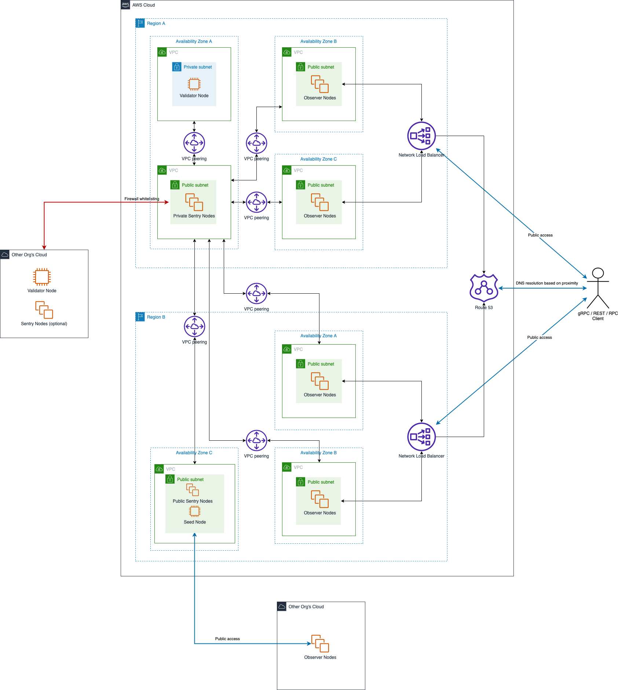

# Recommended design for DCL MainNet deployment on AWS
## AWS deployment diagram

## Recommended IaC frameworks
- [Terraform](https://www.terraform.io) - for setting up AWS infrastructure
- [Ansible](https://www.ansible.com) - for provisioning DCL nodes

## Node specific AWS and DCL configurations

### Validator Node:
- Tendermint:
    - [config.toml]
        - [p2p]
            - `pex` = false
            - `persistent_peers` = [private sentry nodes with private IPs]
            - `addr_book_strict` = false
    - [app.toml]
        - [state-sync]
            - `snapshot-interval` = snapshot-interval
            - `snapshot-keep-recent` = snapshot-keep-recent

- AWS:
    - Instance type = EC2 instance
    - Network:
        - Private IPv4 = IPv4 address
        - Public IPv4 = not assigned
    - Security:
        - inbound:
            - allow `Tendermint p2p` port from Private Sentry Nodes' VPC CIDR
            - allow `RPC` port from Private Sentry Nodes' VPC CIDR
        - outbound:
            - all

### Private Sentry Node: 
- Tendermint:
    - [config.toml]
        - [p2p]
            - `pex` = true
            - `persistent_peers` = [validator node with private IP + other orgs' validator/sentry nodes with public IPs] 
            - `private_peer_ids` = [validator node id]
            - `unconditional_peers` = [validator node id]
            - `addr_book_strict` = false
        - [statesync]
            - `enable` = true
            - `rpc_servers` = [validator node's RPC endpoint]
            - `trust_height` = trust-height
            - `trust_hash` = trust-hash
    - [app.toml]
        - [state-sync]
            - `snapshot-interval` = snapshot-interval
            - `snapshot-keep-recent` = snapshot-keep-recent
- AWS:
    - Instance type = EC2 instance
    - Network:
        - Private IPv4 = IPv4 address
        - Public IPv4 = Elastic IP
    - Security:
        - inbound:
            - allow `Tendermint p2p` port for whitelist IPs
            - allow `RPC` port from Observer Nodes' VPC CIDR
            - allow `RPC` port from Public Sentry Nodes' VPC CIDR
        - outbound:
            - all

### Observer Node: 
- Tendermint:
    - [config.toml]
        - [p2p]
            - `pex` = true
            - `persistent_peers` = [private sentry nodes private with IPs]
            - `addr_book_strict` = false
        - [statesync]
            - `enable` = true
            - `rpc_servers` = [private sentry nodes' RPC endpoints]
            - `trust_height` = trust-height
            - `trust_hash` = trust-hash
    - [app.toml]
        - [api]
            - `enable` = true
- AWS:
    - Instance type = EC2 instance
    - Network:
        - Private IPv4 = IPv4 address
        - Public IPv4 = not assigned
    - Security:
        - inbound:
            - allow gRPC / REST / RPC ports from the same VPC CIDR
        - outbound:
            - all

### Public Sentry Node: 
- Tendermint:
    - [config.toml]
        - [p2p]
            - `pex` = true
            - `persistent_peers` = [private sentry nodes with private IPs]
        - [statesync]
            - `enable` = true
            - `rpc_servers` = [private sentry nodes' RPC endpoints]
            - `trust_height` = trust-height
            - `trust_hash` = trust-hash
    - [app.toml]
        - [state-sync]
            - `snapshot-interval` = snapshot-interval
            - `snapshot-keep-recent` = snapshot-keep-recent
- AWS:
    - Instance type = EC2 instance
    - Network:
        - Private IPv4 = IPv4 address
        - Public IPv4 = Elastic IP
    - Security:
        - inbound:
            - allow `Tendermint p2p` port from anywhere
            - allow `Tendermint RPC` port from anywhere
        - outbound:
            - all

### Seed Node: 
- Tendermint:
    - [config.toml]
        - [p2p]
            - `pex` = true
            - `seed_mode` = true
            - `persistent_peers` = [public sentry nodes with public IP]
        - [statesync]
            - `enable` = true
            - `rpc_servers` = [private sentry nodes' RPC endpoints]
            - `trust_height` = trust-height
            - `trust_hash` = trust-hash
- AWS:
    - Instance type = EC2 instance
    - Network:
        - Private IPv4 = IPv4 address
        - Public IPv4 = Elastic IP
        - Public DNS = optional
    - Security:
        - inbound:
            - allow `Tendermint p2p` port from everywhere
        - outbound:
            - all

### Load Balancer: 
- AWS:
    - Instance type = Elastic Network Load Balancer
    - Availability Zones = [availability zones of observer nodes from the same region]
    - Network:
        - Private IPv4 = IPv4 address
        - Public IPv4 = not assigned
        - Public DNS = assigned by AWS

    - Target groups:
        - gRPC
            - Registered targets = [observer nodes from all availability zones the same region]
            - Attributes:
                - `Preserve client IP addresses` = disabled
            - Health checks:
                - protocol = TCP
        - REST
            - Registered targets = [observer nodes from all availability zones the same region]
            - Attributes:
                - `Preserve client IP addresses` = disabled
            - Health checks:
                - protocol = TCP
        - RPC
            - Registered targets = [observer nodes from all availability zones the same region]
            - Attributes:
                - `Preserve client IP addresses` = disabled
            - Health checks:
                - protocol = TCP

    - Listeners:
        - gRPC
            - Protocol = TLS
            - Forward to = gRPC target group
            - Security policy = ELBSecurityPolicy-TLS13-1-2-2021-06
            - Default SSL/TLS certificate = CA signed TLS certificate
        - REST
            - Protocol = TLS
            - Forward to = REST target group
            - Security policy = ELBSecurityPolicy-TLS13-1-2-2021-06
            - Default SSL/TLS certificate = CA signed TLS certificate
        - RPC 
            - Protocol = TLS
            - Forward to = RPC target group
            - Security policy = ELBSecurityPolicy-TLS13-1-2-2021-06
            - Default SSL/TLS certificate = CA signed TLS certificate